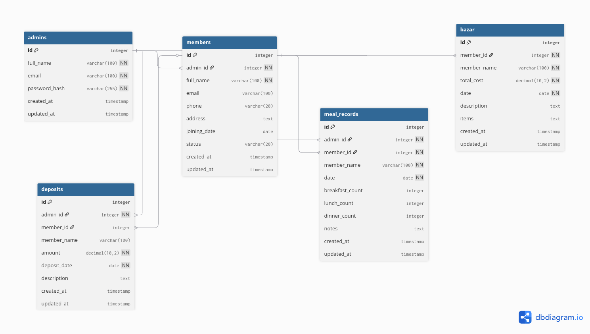

# Meal Mate - Multi-Tenant Meal Management System

A comprehensive meal management system for hostels and shared accommodations with multi-tenant architecture, built using Node.js, Express, and MySQL.

## Features

### Authentication & Security

- Secure user registration and login
- Password hashing with bcrypt
- Admin-based multi-tenant data isolation
- Real-time form validation
- Session management

### Meal Management

- Daily meal tracking and recording
- Individual meal cost calculation
- Monthly meal statistics
- Meal history and analytics

### Bazar (Shopping) Management

- Expense tracking and categorization
- Admin-dependent expense filtering
- Real-time expense calculations
- Shopping history management

### Member Management

- Member registration and profiles
- Admin-controlled member access
- Member status tracking
- Multi-tenant member isolation

### Financial Management

- Deposit tracking and management
- Automatic balance calculations
- Financial summaries and reports
- Individual and group financial analytics

### Dashboard & UI

- Comprehensive admin dashboard
- Modern responsive UI design
- Real-time data updates
- Cross-page navigation with admin ID preservation

## Setup Instructions

### 1. Prerequisites

Make sure you have installed:

- Node.js (v14 or higher)
- MySQL Server
- npm (comes with Node.js)

### 2. Database Setup

1. Start your MySQL server
2. Create a new database:

   ```sql
   CREATE DATABASE meal_management;
   USE meal_management;
   ```

3. The application will automatically create required tables on first run

### 3. Configure Database Connection

In `server.js`, update the database connection settings:

```javascript
const db = mysql.createConnection({
  host: 'localhost',
  user: 'your_mysql_username',    // Change this
  password: 'your_mysql_password', // Change this
  database: 'meal_management'     // Updated database name
});
```

### 4. Install Dependencies

Run the following command in the project directory:

```bash
npm install
```

### 5. Start the Server

Run one of these commands:

```bash
# Production mode
npm start

# Development mode (with auto-restart)
npm run dev
```

### 6. Access the Application

Open your browser and go to:

```
http://localhost:3000
```

## File Structure

```
dbms(academic-project)/
├── server.js                    # Node.js backend server with APIs
├── index.html                   # Landing page
├── login.html                   # User authentication
├── sign-up.html                 # User registration
├── dashboard.html               # Admin dashboard
├── members.html                 # Member management
├── meal-management.html         # Daily meal tracking
├── bazar.html                   # Expense management
├── deposit.html                 # Financial deposits
├── profile.html                 # User profile management
├── dashboard.js                 # Dashboard functionality
├── members.js                   # Member management logic
├── meal-management.js           # Meal tracking logic
├── bazar.js                     # Expense tracking logic
├── deposit.js                   # Deposit management logic
├── profile.js                   # Profile management logic
├── login.js                     # Authentication logic
├── main.js                      # Shared utilities
├── styles.css                   # Main styling
├── dashboard-styles.css         # Dashboard specific styles
├── profile-styles.css           # Profile specific styles
├── login.css                    # Login page styles
├── package.json                 # Node.js dependencies
└── README.md                    # This file
```

## API Endpoints

### Authentication

- **POST /signup** - User registration
- **POST /login** - User authentication

### Members Management

- **GET /members** - Get all members for admin
- **POST /members** - Add new member
- **PUT /members/:id** - Update member details
- **DELETE /members/:id** - Remove member

### Meal Management

- **GET /meals** - Get meal records for admin
- **POST /meals** - Add new meal record
- **PUT /meals/:id** - Update meal record
- **DELETE /meals/:id** - Delete meal record

### Bazar (Expenses) Management

- **GET /bazar** - Get expense records for admin
- **POST /bazar** - Add new expense
- **PUT /bazar/:id** - Update expense record
- **DELETE /bazar/:id** - Delete expense record

### Deposits Management

- **GET /deposits** - Get deposit records for admin
- **POST /deposits** - Add new deposit
- **PUT /deposits/:id** - Update deposit record
- **DELETE /deposits/:id** - Delete deposit record

### Example API Request

**POST /members**

Request Body:

```json
{
  "name": "John Doe",
  "email": "john@example.com",
  "phone": "1234567890",
  "adminId": 1
}
```

Response:

```json
{
  "success": true,
  "message": "Member added successfully!",
  "memberId": 5
}
```

## Security Features

- **Multi-tenant Architecture**: Admin-based data isolation ensures each admin only accesses their own data
- **Password Security**: Password hashing using bcrypt for secure authentication
- **SQL Injection Prevention**: Parameterized queries protect against SQL injection attacks
- **Admin Validation**: All API endpoints validate admin ownership before data access
- **Session Management**: Secure session handling for user authentication
- **Data Integrity**: Comprehensive validation on both client and server sides
- **CORS Configuration**: Proper cross-origin resource sharing setup

## Database Normalization

### Current Normalization Level: **2NF (Second Normal Form)**

The Meal Mate database follows proper normalization principles to ensure data integrity and efficient storage:

#### ✅ **First Normal Form (1NF) - Achieved**
- **Atomic Values**: Each column contains indivisible data (no comma-separated values)
- **Unique Rows**: Primary keys ensure row uniqueness across all tables
- **No Repeating Groups**: No repeated columns like `meal1`, `meal2`, etc.

```sql
-- Example: meal_records table structure
breakfast_count INTEGER,  -- Single atomic value
lunch_count INTEGER,      -- Single atomic value  
dinner_count INTEGER      -- Single atomic value
```

#### ✅ **Second Normal Form (2NF) - Achieved**
- **Eliminates Partial Dependencies**: All non-key attributes depend on the entire primary key
- **Proper Foreign Key Relationships**: Clean relationships between admins, members, meals, expenses, and deposits

```sql
-- Example: All attributes depend on the full primary key
Table meal_records:
  id (Primary Key) → member_id, member_name, date, meal_counts, notes
```

#### ⚠️ **Third Normal Form (3NF) - Design Choice**

**Current Structure (2NF with denormalization):**
```sql
-- Intentional denormalization for performance
meal_records: id, member_id, member_name, date, meal_counts
bazar: id, member_id, member_name, total_cost, date
```

**Why We Chose 2NF Over Full 3NF:**

| Aspect | Current 2NF Structure | Full 3NF Structure |
|--------|----------------------|-------------------|
| **Query Performance** | ✅ Faster (no JOINs needed) | ⚠️ Slower (requires JOINs) |
| **Application Complexity** | ✅ Simpler queries | ❌ More complex queries |
| **Data Redundancy** | ⚠️ Minimal (`member_name` duplicated) | ✅ No redundancy |
| **Update Anomalies** | ⚠️ Rare (member names rarely change) | ✅ None |
| **Real-world Usage** | ✅ Optimized for read-heavy operations | ✅ Better for write-heavy operations |

**Benefits of Our Approach:**
- **Performance Optimization**: Read-heavy meal management operations are faster
- **Simplicity**: Easier maintenance and debugging
- **Practical Design**: Member names rarely change in hostel environments
- **Acceptable Trade-off**: Minimal redundancy for significant performance gains

**Database Design Principles Applied:**
- ✅ **ACID Compliance**: Atomicity, Consistency, Isolation, Durability
- ✅ **Referential Integrity**: Foreign key constraints maintain data relationships
- ✅ **Data Consistency**: Multi-tenant isolation prevents data mixing
- ✅ **Performance Indexing**: Optimized indexes for common query patterns

## ER Diagram

The Entity-Relationship diagram below illustrates the database structure and relationships between tables in the Meal Mate system:



### Key Relationships:

- **Admins (1) → Members (N)**: One admin can manage multiple members
- **Members (1) → Meal Records (N)**: One member can have multiple daily meal records
- **Members (1) → Bazar Records (N)**: One member can have multiple shopping expense records
- **Admins (1) → Deposits (N)**: One admin can manage multiple deposit records
- **Members (1) → Deposits (N)**: One member can make multiple deposits (optional relationship)

### Entity Details:

- **system_admins**: Store admin authentication and profile information
- **system_members**: Store member details with admin association
- **daily_meal_records**: Track daily meal consumption per member
- **shopping_expenses**: Record shopping/market expenses by members
- **financial_deposits**: Track financial deposits with admin and member association

The diagram demonstrates the multi-tenant architecture where data isolation is maintained through admin-based relationships, ensuring each admin only accesses their own organizational data.

## Tech Stack

- **Backend**: Node.js with Express.js framework
- **Database**: MySQL with connection pooling
- **Frontend**: Vanilla JavaScript with modern ES6+ features
- **Styling**: CSS3 with responsive design and modern UI components
- **Security**: bcrypt for password hashing, parameterized queries
- **Architecture**: Multi-tenant SaaS application design

## Getting Started

1. Clone the repository
2. Install dependencies with `npm install`
3. Configure your MySQL database connection
4. Start the server with `npm start`
5. Access the application at `http://localhost:3000`

## Author

Abdullah Al Fuwad

## License

ISC License
